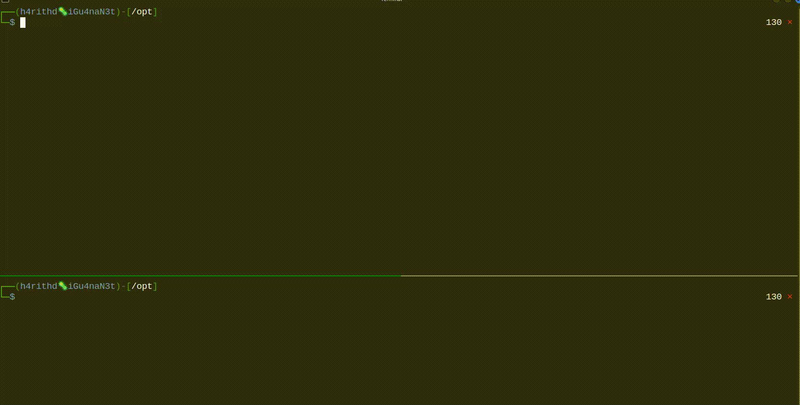

# SPython3
---
SPython3 is a simple HTTPS server written in Python 3, designed to check XSS vulnerabilities when the secure attribute of a cookie is set to true. It is built using Python's built-in `http.server` module and outputs server logs to the terminal for easy debugging.

### Usage
To use SPython3, simply run the `spython3.py` file with Python3. The server will start listening on the default port of 443, and logs will be output to the terminal in a tabulated format. You can also specify a different IP address and port to listen on using the `-i` and `-p` options, respectively.

```
git clone https://github.com/h4rithd/SPython3 && cd SPython
python3 spython3.py or python3 spython3.py [-i IP] [-p PORT]
```


---

### Features
* Generates self-signed SSL certificates if none are found in the system's temporary directory
* Logs all incoming requests to the terminal in a tabulated format
* Supports GET, POST, PUT, and DELETE methods

### Dependencies
* Python 3
* `tabulate` module (`pip install tabulate`)
* `prettytable` module (`pip install prettytable`)
* `OpenSSL` module (`pip install pyOpenSSL`)

### License
SPython3 is licensed under the MIT `License`. See the LICENSE file for more information.

### Acknowledgements
SPython3 was created by Harith Dilshan. If you find any bugs or have any suggestions for improvement, please feel free to open an issue or pull request on the project's GitHub page.

---
